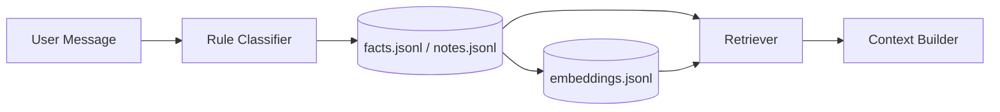
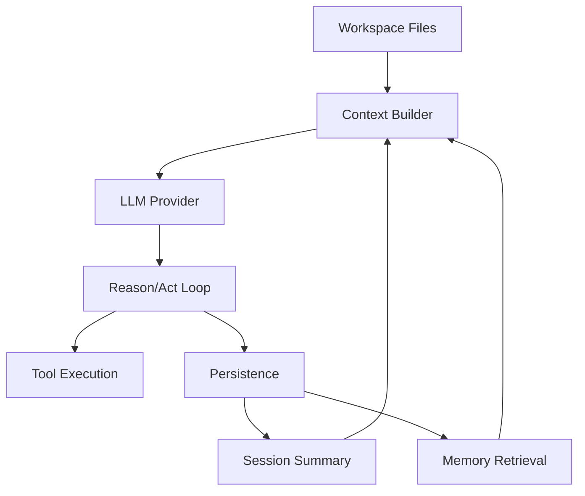

<p align="center">
  
</p>

<p align="center">
  <b>Local-first  Workspace-driven  Memory-native AI runtime</b><br/>
  Inspired by OpenClaw
</p>

<p align="center">
  
  
  
  
  
</p>

---

## Overview

ClawCore is a local-first AI agent runtime built around:

- Workspaces as intelligence units
- Persistent memory + summarization
- Structured reasoning/acting loops
- Tool-driven execution

---

## What's Inside

```text
Workspace -> Context -> Reason -> Act -> Persist -> Repeat
```

- Workspace loader: `AGENT.md`, `SOUL.md`, `TOOLS.md`, `USER.md`, `BOOTSTRAP.md`
- Session persistence: `transcript.jsonl`, `state.json`, `summary.md`, `tool_calls.jsonl`
- Context builder: workspace + history + memory + tools — delivered as a proper `[system, user, assistant, ...]` message list
- Agent loop: structured reason/act cycle with configurable step/tool/reasoning caps and one repair retry for malformed output
- Tool registry (safe built-ins): `list_files`, `read_file`, `get_datetime`, `search_web`, `read_url`
- Interfaces: FastAPI `POST /chat`, CLI, Telegram webhook
- Providers: any OpenAI-compatible endpoint via one generic `HttpProvider`

---

## Quick Start

### Install

```bash
python -m pip install -e .
```

### Configure `.env`

```bash
# ── LLM Provider ──────────────────────────────────────────────────────────────
# Provider: openrouter | openai | kimi | mock
LLM_PROVIDER=openrouter
LLM_API_KEY=your_key_here
LLM_MODEL=your_model_here
# LLM_BASE_URL=   # leave empty for provider default
LLM_TIMEOUT_SECONDS=60
LLM_TEMPERATURE=0.2
LLM_MAX_TOKENS=3000
MAX_STEPS=10
MAX_TOOL_CALLS=5
MAX_REASONING_ACTIONS=5
LLM_MAX_RETRIES=1

# ── Memory ────────────────────────────────────────────────────────────────────
MEMORY_RETRIEVAL_MODE=hybrid
MEMORY_DISTILL_EVERY_TURNS=6
SESSION_MAX_AGE_DAYS=30

# ── Session Summary ───────────────────────────────────────────────────────────
# Provider: openrouter | openai | kimi | ollama | heuristic
SUMMARY_UPDATER_PROVIDER=openrouter
SUMMARY_API_KEY=your_summary_key_here
SUMMARY_MODEL=your_summary_model_here
# SUMMARY_BASE_URL=   # leave empty for provider default
SUMMARY_EVERY_TURNS=3
SUMMARY_TOKEN_CAP=3000
SUMMARY_DELTA_MAX_LINES=3
SUMMARY_COMPACT_TARGET_TOKENS=500
SUMMARY_TIMEOUT_SECONDS=30
SUMMARY_TEMPERATURE=0.2

# ── Telegram ──────────────────────────────────────────────────────────────────
TELEGRAM_BOT_TOKEN=
TELEGRAM_WEBHOOK_SECRET=
TELEGRAM_WORKSPACE_ID=default-agent
TELEGRAM_TIMEOUT_SECONDS=20

# ── Telegram auto-setup ───────────────────────────────────────────────────────
TELEGRAM_AUTO_SETUP=false
TELEGRAM_AUTO_NGROK=false
TELEGRAM_PUBLIC_BASE_URL=
TELEGRAM_LOCAL_PORT=8000
TELEGRAM_STARTUP_TIMEOUT_SECONDS=20
NGROK_PATH=ngrok
NGROK_AUTHTOKEN=
```

---

### Run API

```bash
uvicorn src.core.app:app --reload
```

### CLI

```bash
python -m src.cli.chat
# or after install
clawcore-chat
```

One-shot:

```bash
python -m src.cli.chat --message "List workspace files"
```

### API Call

```bash
curl -X POST http://127.0.0.1:8000/chat \
  -H "Content-Type: application/json" \
  -d '{"workspace_id":"default-agent","session_id":"session-001","message":"List workspace files"}'
```

---

## LLM Providers

All providers share the same generic config (`LLM_*` env vars). The provider name controls which base URL is used by default:

| Provider | Default base URL |
|---|---|
| `openrouter` | `https://openrouter.ai/api/v1` |
| `openai` | `https://api.openai.com/v1` |
| `kimi` | `https://api.moonshot.ai/v1` |
| `mock` | — (no API calls, offline testing) |

Set `LLM_BASE_URL` to override the default for any provider or to add a new OpenAI-compatible endpoint.

---

## Agent Loop Controls

All limits are configurable via `.env` — no code changes needed:

| Var | Default | Effect |
|---|---|---|
| `MAX_STEPS` | `10` | Total loop iterations before forced stop |
| `MAX_TOOL_CALLS` | `5` | Max tool executions per turn |
| `MAX_REASONING_ACTIONS` | `5` | Max consecutive reasoning steps |
| `LLM_MAX_RETRIES` | `1` | Retries on `429`/`5xx`/timeout |

---

## Memory System



### Write Path

- Per-turn rule classifier stores durable facts/tasks.
- Session distillation runs every `MEMORY_DISTILL_EVERY_TURNS` turns.
- Distillation also runs on flush events:
  - CLI: `/new`, `/exit`
  - Telegram: `/new`, `/exit`

### Manual Memory Triggers

- `save to your memory: <fact>`
- `memorize that <fact>`
- `note this: <fact>`

### Retrieval Modes

| Mode | Behaviour |
|---|---|
| `hybrid` | Vector ranking + keyword fill (default) |
| `vector` | Semantic retrieval only |
| `keyword` | Lexical matching only |

### Storage

- `workspaces/<id>/memory/facts.jsonl`
- `workspaces/<id>/memory/notes.jsonl`
- `workspaces/<id>/memory/embeddings.jsonl`

---

## Session Summarization

Summaries are built incrementally each session and stored in `summary.md`. The summary LLM is **independent** from the main LLM — you can use a cheap/free model here.

| Var | Default | Effect |
|---|---|---|
| `SUMMARY_UPDATER_PROVIDER` | `heuristic` | Which model writes summaries |
| `SUMMARY_EVERY_TURNS` | `3` | How often summary runs (to avoid rate limits) |
| `SUMMARY_TOKEN_CAP` | `3000` | Max summary size before compaction |
| `SUMMARY_DELTA_MAX_LINES` | `3` | Lines added per turn |
| `SUMMARY_MAX_FAILURES` | `3` | Failures before cooldown |
| `SUMMARY_COOLDOWN_SECONDS` | `60` | Cooldown duration after max failures |

### Summary Providers

- `openrouter`, `openai`, `kimi` — any OpenAI-compatible endpoint, configured via `SUMMARY_API_KEY` + `SUMMARY_MODEL`
- `ollama` — local Ollama instance (`SUMMARY_BASE_URL` + `SUMMARY_MODEL`)
- `heuristic` — no API calls; clips and appends turn text (always works, lower quality)

On any failure the summary falls back to heuristic for that turn and retries next time.

---

## Session Management

Sessions accumulate under `workspaces/<id>/sessions/`. Use the `/prune` CLI command to clean up old ones:

```text
/prune   Delete sessions older than SESSION_MAX_AGE_DAYS (default: 30)
```

Age is measured from the last message in the session transcript.

---

## Token Usage

Each response includes:

- `prompt_tokens`, `completion_tokens`
- `session_prompt_tokens_total`, `session_completion_tokens_total`
- `context_tokens_estimate`, `context_chars`

CLI also prints memory mode, memory hits, summary queue status, and memory distill status per turn.

---

## Telegram Integration

### Endpoint

```text
POST /webhook/telegram
```

### Commands

- `/help` — show commands
- `/session` — show active session id
- `/new` — flush + rotate to new session
- `/exit` — flush + close current session

### Session Behavior

- First session defaults to `tg-<chat_id>`
- `/new` creates `tg-<chat_id>-<utc-stamp>`
- After `/exit`, next message starts fresh

### Setup

Manual webhook:

```bash
curl -X POST "https://api.telegram.org/bot<TELEGRAM_BOT_TOKEN>/setWebhook" \
  -d "url=https://<your-domain>/webhook/telegram" \
  -d "secret_token=<TELEGRAM_WEBHOOK_SECRET>"
```

Helper script:

```powershell
powershell -ExecutionPolicy Bypass -File .\scripts\setup_telegram_webhook.ps1 -PublicBaseUrl "https://<your-domain>"
```

Auto setup options:

- `TELEGRAM_AUTO_SETUP=true`
- Either set `TELEGRAM_PUBLIC_BASE_URL=https://...`
- Or set `TELEGRAM_AUTO_NGROK=true` + `NGROK_AUTHTOKEN`

---

## Workspace Tool Policy

Resolution order:

```text
Global Tools
  -> workspaces/<id>/skills/enabled.json
  -> TOOLS.md (allow/deny)
```

`skills/enabled.json`:

```json
{
  "enabled_tools": ["tool_a"],
  "disabled_tools": ["tool_x"],
  "enabled_skills": ["research-assistant"]
}
```

`TOOLS.md` directives:

```text
allow: tool_a, tool_b
deny: tool_x, tool_y
```

Rules: `allow` narrows toolset; `deny` always wins; unknown tools are skipped.

---

## Skills System

```text
workspaces/<id>/skills/<skill-name>/
  skill.json
  SKILL.md
```

- `SKILL.md` instructions are injected into context.
- `skill.json` can override tool access (`enabled_tools`, `disabled_tools`, `allow_tools`, `deny_tools`).

---

## Errors and Reliability

- Missing `LLM_API_KEY` or `LLM_MODEL` for any non-mock provider → config error at startup.
- Upstream provider failures map to HTTP `502` from `/chat`.
- `LLM_MAX_RETRIES` controls retry attempts for transient `429`/`5xx`/timeout failures (default: 1).

---

## Offline Mode

```bash
LLM_PROVIDER=mock
```

No API key required. Useful for testing tool execution, memory, and loop logic.

---

## Architecture



---

<p align="center">
  <i>ClawCore — build agents that remember, adapt, and act.</i>
</p>
