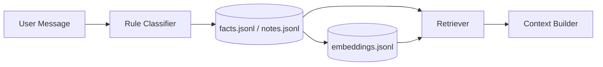
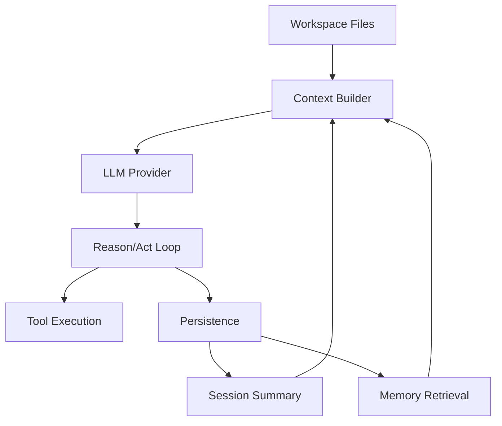

<p align="center">
  
</p>

<p align="center">
  <b>Local-first  Workspace-driven  Memory-native AI runtime</b><br/>
  Inspired by OpenClaw
</p>

<p align="center">
  
  
  
  
  
</p>

---

## Overview

ClawCore is a local-first AI agent runtime built around:

- Workspaces as intelligence units
- Persistent memory + summarization
- Structured reasoning/acting loops
- Tool-driven execution

---

## MVP Included

```text
Workspace -> Context -> Reason -> Act -> Persist -> Repeat
```

- Workspace loader:
  - `AGENT.md`, `SOUL.md`, `TOOLS.md`, `USER.md`, `BOOTSTRAP.md`
- Session persistence:
  - `transcript.jsonl`
  - `state.json`
  - `summary.md`
  - `tool_calls.jsonl`
- Context builder:
  - workspace + history + memory + tools + user input
- Agent loop:
  - structured reason/act cycle
  - max-step safeguards
  - one repair retry for malformed/unsupported action output
- Tool registry (safe built-ins):
  - `list_files`
  - `read_file`
  - `get_datetime`
  - `search_web`
  - `read_url`
- Interfaces:
  - FastAPI -> `POST /chat`
  - CLI -> `python -m src.cli.chat`
  - Telegram webhook -> `POST /webhook/telegram`
- Providers:
  - `kimi` (default)
  - `mock` (offline)

---

## Quick Start

### Install

```bash
python -m pip install -e .
```

### Configure `.env`

```bash
# LLM
LLM_PROVIDER=kimi
KIMI_API_KEY=your_key_here
KIMI_MODEL=kimi-k2.5
KIMI_BASE_URL=https://api.moonshot.ai/v1
KIMI_TIMEOUT_SECONDS=60
KIMI_TEMPERATURE=1
KIMI_MAX_TOKENS=800

# Memory
MEMORY_DISTILL_EVERY_TURNS=6
MEMORY_RETRIEVAL_MODE=hybrid

# Summary
SUMMARY_UPDATER_PROVIDER=ollama
OLLAMA_BASE_URL=http://127.0.0.1:11434
OLLAMA_SUMMARY_MODEL=gpt-oss:20b
SUMMARY_TOKEN_CAP=1000
SUMMARY_DELTA_MAX_LINES=3
SUMMARY_COMPACT_TARGET_TOKENS=350
SUMMARY_TIMEOUT_SECONDS=30
SUMMARY_TEMPERATURE=0.1
SUMMARY_OLLAMA_MAX_FAILURES=3
SUMMARY_OLLAMA_COOLDOWN_SECONDS=60

# Telegram
TELEGRAM_BOT_TOKEN=
TELEGRAM_WEBHOOK_SECRET=
TELEGRAM_WORKSPACE_ID=default-agent
TELEGRAM_TIMEOUT_SECONDS=20

# Telegram auto-setup
TELEGRAM_AUTO_SETUP=false
TELEGRAM_AUTO_NGROK=false
TELEGRAM_PUBLIC_BASE_URL=
TELEGRAM_LOCAL_PORT=8000
TELEGRAM_STARTUP_TIMEOUT_SECONDS=20
NGROK_PATH=ngrok
NGROK_AUTHTOKEN=
```

---

### Run API

```bash
uvicorn src.core.app:app --reload
```

### CLI

```bash
python -m src.cli.chat
# or after install
clawcore-chat
```

One-shot:

```bash
python -m src.cli.chat --message "List workspace files"
```

### API Call

```bash
curl -X POST http://127.0.0.1:8000/chat \
  -H "Content-Type: application/json" \
  -d '{"workspace_id":"default-agent","session_id":"session-001","message":"List workspace files"}'
```

---

## Memory System



### Write Path

- Per-turn rule classifier stores durable facts/tasks.
- Session distillation runs every `MEMORY_DISTILL_EVERY_TURNS` turns.
- Distillation also runs on flush events:
  - CLI: `/new`, `/exit`
  - Telegram: `/new`, `/exit`

### Manual Memory Triggers

You can force memory capture with explicit phrasing:

- `save to your memory: <fact>`
- `memorize that <fact>`
- `note this: <fact>`

### Retrieval Modes

```bash
MEMORY_RETRIEVAL_MODE=hybrid
MEMORY_RETRIEVAL_MODE=vector
MEMORY_RETRIEVAL_MODE=keyword
```

- `hybrid`: vector ranking + keyword fill
- `vector`: semantic retrieval only
- `keyword`: lexical matching only

### Storage

- `workspaces/<id>/memory/facts.jsonl`
- `workspaces/<id>/memory/notes.jsonl`
- `workspaces/<id>/memory/embeddings.jsonl`

---

## Session Summarization

- Incremental turn updates (`SUMMARY_DELTA_MAX_LINES`)
- Auto-compaction (`SUMMARY_TOKEN_CAP`, `SUMMARY_COMPACT_TARGET_TOKENS`)
- Background queue (non-blocking for chat response path)

### Providers

- `SUMMARY_UPDATER_PROVIDER=ollama` (default)
- `SUMMARY_UPDATER_PROVIDER=heuristic`

### Ollama Reliability

If Ollama fails repeatedly, summary updater falls back safely:

- `SUMMARY_OLLAMA_MAX_FAILURES` (default `3`)
- `SUMMARY_OLLAMA_COOLDOWN_SECONDS` (default `60`)

This avoids one-time permanent disable.

---

## Token Usage

Each response includes:

- `prompt_tokens`
- `completion_tokens`
- `session_prompt_tokens_total`
- `session_completion_tokens_total`
- `context_tokens_estimate`
- `context_chars`

CLI also prints:

- `memory_mode`
- `memory_hits`
- summary queue status
- memory distill status

---

## Telegram Integration

### Endpoint

```text
POST /webhook/telegram
```

### Commands

- `/help` -> show commands
- `/session` -> show active session id
- `/new` -> flush + rotate to new session
- `/exit` -> flush + close current session

### Session Behavior

- First session defaults to `tg-<chat_id>`
- `/new` creates `tg-<chat_id>-<utc-stamp>`
- After `/exit`, next message starts fresh

### Setup

Manual webhook:

```bash
curl -X POST "https://api.telegram.org/bot<TELEGRAM_BOT_TOKEN>/setWebhook" \
  -d "url=https://<your-domain>/webhook/telegram" \
  -d "secret_token=<TELEGRAM_WEBHOOK_SECRET>"
```

Helper script:

```powershell
powershell -ExecutionPolicy Bypass -File .\scripts\setup_telegram_webhook.ps1 -PublicBaseUrl "https://<your-domain>"
```

Auto setup options:

- `TELEGRAM_AUTO_SETUP=true`
- Either set `TELEGRAM_PUBLIC_BASE_URL=https://...`
- Or set `TELEGRAM_AUTO_NGROK=true` + `NGROK_AUTHTOKEN`

---

## Workspace Tool Policy (v1)

Resolution order:

```text
Global Tools
  -> workspaces/<id>/skills/enabled.json
  -> TOOLS.md (allow/deny)
```

`skills/enabled.json` supports:

```json
{
  "enabled_tools": ["tool_a"],
  "disabled_tools": ["tool_x"],
  "enabled_skills": ["research-assistant"]
}
```

`TOOLS.md` directives:

```text
allow: tool_a, tool_b
deny: tool_x, tool_y
```

Rules:

- `allow` narrows toolset
- `deny` always wins
- unknown tools are skipped

---

## Skills System

Skill folder shape:

```text
workspaces/<id>/skills/<skill-name>/
  skill.json
  SKILL.md
```

- `SKILL.md` instructions are injected into context.
- `skill.json` can override tool access (`enabled_tools`, `disabled_tools`, `allow_tools`, `deny_tools`).

---

## Errors and Reliability

- Missing `KIMI_API_KEY` or `KIMI_MODEL` when provider is `kimi` -> config error.
- Upstream provider failures map to HTTP `502` from `/chat`.
- Kimi provider performs one retry for transient `429`/`5xx`/timeout failures.

---

## Offline Mode

```bash
LLM_PROVIDER=mock
```

---

## Architecture



---

<p align="center">
  <i>ClawCore � build agents that remember, adapt, and act.</i>
</p>
